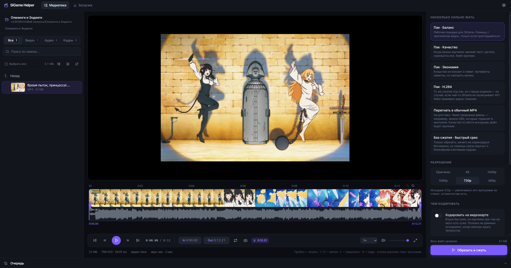
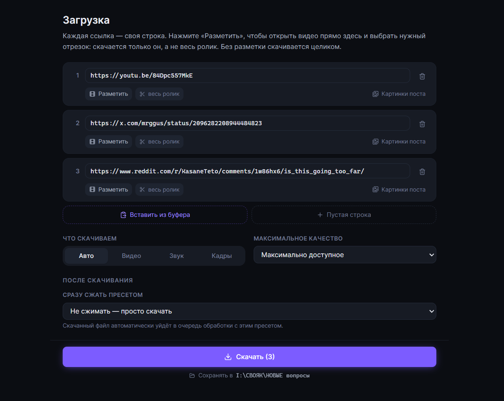
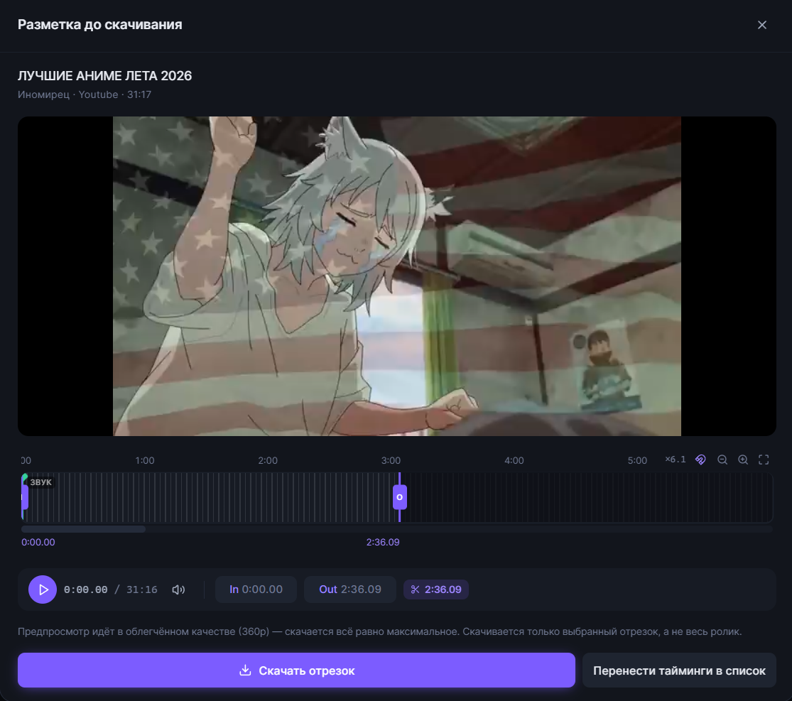
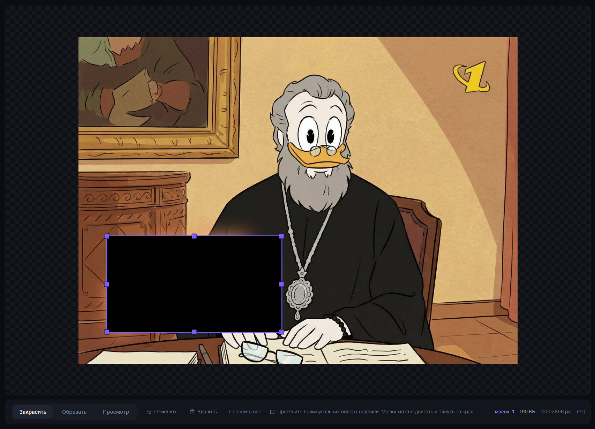
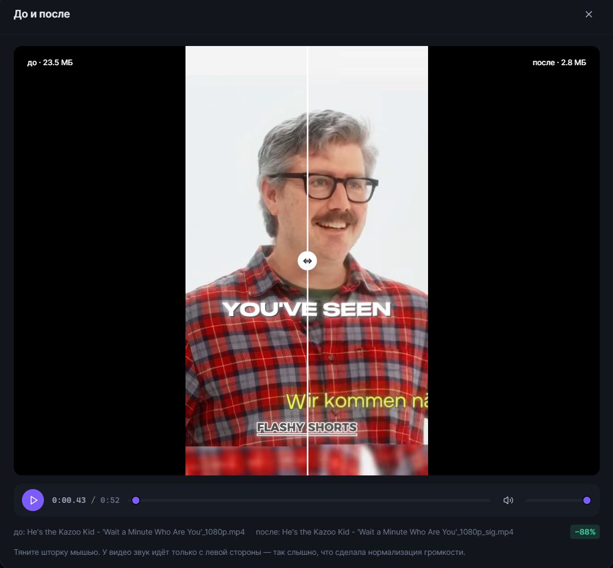
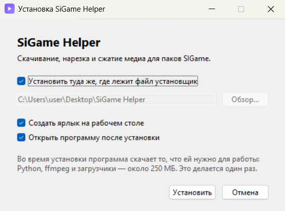

# SiGame Helper

Локальный «комбайн» для подготовки медиа к паками SIGame / SIQuester: скачать,
нарезать, сжать — в одном окне.

Пак в SIQuester ограничен 150 МБ, и без сжатия этот лимит расходуется за
несколько вопросов. Приложение решает всю цепочку: качает исходники по ссылке,
даёт вырезать нужный фрагмент в плеере с таймлайном и отдаёт результат
в современных кодеках, которые весят в разы меньше.

 



---

## Что умеет

**Загрузка**
- Список ссылок с номерами: длинная ссылка переносится по строкам, но остаётся
  одной записью. Вставили десяток разом — они сами разложатся по строкам.
- **Разметка до скачивания**: кнопка «Разметить» открывает видео прямо в
  программе, вы ставите метки In/Out — и скачивается только этот отрезок,
  а не весь ролик. Тайминги можно и просто вписать руками.
- Видео и звук через `yt-dlp`, картинки из постов X/Twitter, Instagram, Reddit,
  Pixiv и десятков других сайтов — через `gallery-dl`.
- В посте несколько картинок? Показывается сетка с превью — отмечаете нужные.
- Видео автоматически приводится к MP4, чтобы встроенный плеер точно открыл его
  со звуком.
- Скачанное можно сразу отправить в очередь сжатия выбранным пресетом.

**Редактор видео и звука**
- Настоящий HTML5-плеер: перемотка, громкость, полный экран, скорость просмотра.
- Таймлайн как в монтажке: **отдельная дорожка видео** с кадрами и **отдельная
  дорожка звука** с осциллограммой.
- Метки **In** / **Out** стоят на краях файла сразу: тяните ползунки мышью или
  ставьте клавишами `I` и `O`.
- **Дорожку можно приблизить** — колесом мыши или кнопками. Приближение всегда
  идёт к игле воспроизведения, под дорожкой появляется полоса прокрутки. Без
  этого на часовом видео метку точнее полуминуты не поставить.
- **Затухания как в Vegas**: у каждой дорожки свой уголок в верхнем углу —
  потяните его внутрь, и картинка или звук будут плавно появляться и уходить.
  У видео и звука затухания независимые, и их **видно и слышно прямо в плеере**,
  ещё до экспорта. Звук уходит по плавной кривой, а не линейно.
- Зацикленный предпросмотр выделенного отрезка (`L`).
- Кнопка **«Сохранить кадр»** (`S`) вытаскивает стоп-кадр и сразу жмёт его в AVIF.
- Точная нарезка с перекодированием или мгновенный срез копированием потока.

**Сжатие видео**
- **AV1 (SVT-AV1)** по умолчанию — при том же качестве заметно легче H.264.
- Пресеты вместо настроек: «Баланс», «Качество», «Экономия» и H.264 на случай
  старого клиента. Кодеки, CRF и контейнеры спрятаны внутрь — их не нужно знать.
- Отдельный пресет **«Перегнать в обычный MP4»** — не для пака, а чтобы
  починить капризный файл (скажем, запись OBS, которая тормозит в монтажке).
  Качество остаётся исходным.
- Галочка **«Кодировать на видеокарте»** работает с любым пресетом. Появляется
  только если программа реально смогла закодировать кадр на вашем железе.
  Втрое быстрее, файл чуть крупнее.
- **Разрешение выбирается отдельно**: «оригинал», 4K, 1440p, 1080p, 720p или 480p.
  Программа сама подгоняет силу сжатия под итоговый размер кадра — маленькое
  видео не получит настройки, рассчитанные на большое. Вверх ничего никогда
  не растягивается.

**Сжатие звука**
- Кодек **Opus**: 96 кбит/с звучит примерно как MP3 160 кбит/с.
- Две галочки на всё: **выровнять громкость** (чтобы одни вопросы не глушили
  другие) и **свести в моно** (для речи, экономит треть веса).

**Редактор и сжатие изображений**
- **Закраска**: протяните прямоугольник поверх бренда, логотипа или подписи.
  Масок можно наставить сколько угодно, каждую потом двигают, растягивают за
  стороны и углы, удаляют клавишей `Delete`. Ctrl+Z откатывает.
- **Обрезка**: рамка отрезает пустые поля и чёрные края. Её тоже можно править.
- Три уровня **AVIF** — лёгкое, среднее и экстремальное сжатие. Никаких
  килобайтов и проходов подбора: программа сама подберёт качество.
- WebP, JPEG и PNG — для сайтов, которые ещё не понимают AVIF.

**Медиатека**
- Список или **плитка с превью** — переключается одной кнопкой.
- **Ваша структура папок сохраняется**: по подпапкам пака можно ходить, как в
  проводнике. Отдельная кнопка показывает всё вложенное одним списком.
- Всё скачанное и обработанное само раскладывается по папкам «Видео», «Аудио»
  и «Картинки» — в куче ничего не валяется.
- Фильтры по типу, поиск, отметка файлов для пакетной обработки.
- Сравнение **«до и после»** шторкой: и для картинок, и для видео. У видео
  оба ролика идут синхронно, звук — со стороны оригинала, так что слышно,
  что сделала нормализация.

**Для тех, кому мало пресетов**
- Кнопка «Показать команду ffmpeg» под настройками экспорта открывает готовую
  команду — её можно **править и запускать как есть**. Всё, что умеет ffmpeg,
  но чего нет в интерфейсе, делается там. Запускается только ffmpeg, ничего
  постороннего.

**Очередь**
- Все операции идут в фоне отдельными процессами `ffmpeg`, интерфейс не
  подвисает даже на длинном видео.
- Прогресс, скорость, журнал и отмена по каждой задаче.
- Пакетная обработка: отметили десяток файлов — обработались по очереди.

---

## Как это выглядит

**Загрузка по ссылкам.** Каждая ссылка — своя строка, к любой можно задать отрезок.



**Разметка до скачивания.** Видео открывается прямо в программе, вы ставите метки —
и скачивается только нужный кусок, а не вся серия.



**Редактор изображений.** Закрасить бренд или надпись, обрезать пустые поля.
Маски можно двигать, растягивать и откатывать через Ctrl+Z.



**До и после.** Шторка показывает, что именно сделало сжатие. На скриншоте
23.5 МБ превратились в 2.8 МБ — и разницы не видно.



---

## Установка

1. Скачайте **`Установка SiGame Helper.exe`** со страницы
   [Releases](../../releases).
2. Запустите его.



Откроется обычный установщик: спросит, куда ставить, нужен ли ярлык на
рабочем столе и открыть ли программу после установки. Всё остальное он
сделает сам — скачает Python, `ffmpeg`, `Deno` и загрузчики (около 250 МБ)
и покажет ход дела полосой прогресса.

По умолчанию программа ставится **рядом с самим установщиком**, в подпапку
«SiGame Helper»: положили файл на рабочий стол — там она и окажется.
Снимите галочку, если хотите выбрать другое место.

Ставить заранее ничего не нужно, права администратора не требуются.
Удаляется программа удалением своей папки.

> Windows может один раз показать синее окно «SmartScreen: неизвестный
> издатель» — так она встречает любую программу без платной подписи.
> Нажмите **«Подробнее» → «Выполнить в любом случае»**.

> Deno — движок JavaScript. Он нужен `yt-dlp`, чтобы решать защитные задачки
> YouTube: без него сайт отвечает «Sign in to confirm you're not a bot» или
> «The page needs to be reloaded» даже с правильными куками.

> Если хотите, чтобы программа пользовалась **вашим** ffmpeg — положите
> `ffmpeg.exe` и `ffprobe.exe` в папку `bin` внутри установленной папки.
> Только берите **полную** сборку (например,
> <https://www.gyan.dev/ffmpeg/builds/>): в ней есть кодеры `libsvtav1`,
> `libaom-av1` (для AVIF) и `libopus`, в урезанных их нет.

---

## Обновление загрузчиков

Сайты постоянно ломают парсеры, поэтому `yt-dlp` стоит обновлять примерно раз
в месяц: **Настройки → Проверить обновления**, и если рядом с `yt-dlp` или
`gallery-dl` появится кнопка «Обновить» — нажмите её.

С `ffmpeg` и Deno так делать не нужно: они не зависят от вёрстки сайтов
и не «протухают».

---

## Как этим пользоваться

1. Нажмите на название папки в левом верхнем углу и выберите рабочую папку —
   в неё попадёт всё скачанное и обработанное.
2. Вкладка **«Загрузка»**: вставьте ссылки. Нужен кусок из середины часового
   видео? Нажмите **«Разметить»** — ролик откроется прямо здесь, поставьте
   In/Out и качайте только его.
3. Вкладка **«Медиатека»**: кликните файл — откроется плеер с лентой кадров
   и звуковой волной.
4. Двигайте метки `I` и `O`, послушайте отрезок в цикле (`L`).
5. Справа выберите пресет и нажмите **«Обрезать и сжать»**.
6. Результат — в подпапке `Обработанное` рядом с исходником. Оригинал не трогается.
7. В очереди внизу нажмите значок сравнения, чтобы посмотреть **«до и после»**.

**Горячие клавиши плеера**

| Клавиша | Действие |
| --- | --- |
| `Пробел` | Играть / пауза |
| `I` / `O` | Метка начала / конца |
| `L` | Зациклить выделенный отрезок |
| `S` | Сохранить текущий кадр картинкой |
| `←` `→` | Перемотка на 5 секунд |
| `Shift` + `←` `→` | Перемотка по одному кадру |
| `M` | Выключить звук |
| `Home` / `End` | В начало / в конец |

**Таймлайн**

| Действие | Что делает |
| --- | --- |
| Колесо мыши над дорожкой | Приблизить / отдалить к игле |
| Полоса под дорожкой | Ехать по времени на приближении |
| Уголок в верхнем углу дорожки | Затухание — тяните внутрь |

**В редакторе картинок**

| Клавиша | Действие |
| --- | --- |
| `Ctrl` + `Z` | Отменить последнее действие |
| `Delete` | Удалить выделенную маску или рамку |
| `Escape` | Снять выделение |

---

## Про разметку до скачивания

Кнопка «Разметить» работает так: `yt-dlp` разбирает страницу и отдаёт прямую
ссылку на поток, а программа проигрывает его через себя — иначе браузер такой
поток не откроет из-за защиты чужого сайта.

Получается не везде. Проверено на живых ссылках:

| Площадка | Предпросмотр | Скачивание |
| --- | --- | --- |
| YouTube | да | да |
| VK Видео | да | да |
| Mail.ru | да | да |
| Sibnet | да | да |
| OK.ru | нет | нет — ошибка в самом `yt-dlp`, ждём исправления |
| Прямые ссылки на `.mp4` | да | да |

Если предпросмотр недоступен, программа предложит **скачать черновик 360p**.
Разметьте его в обычном редакторе, вернитесь на вкладку «Загрузка» и впишите
тайминги руками — финальный отрезок скачается в полном качестве. Тайминги можно
вписывать и сразу, не открывая предпросмотр: в формате `1:23` или просто `83`.

**А если дать ссылку не на плеер, а на страницу сайта?**

Для площадок, которые `yt-dlp` знает в лицо (YouTube, VK, Reddit, X, Instagram,
Imgur и ещё сотни), ссылка на пост или страницу работает — он сам найдёт там
медиа. Для остальных сайтов он просматривает HTML страницы в поисках
видео. Если плеер подставляется скриптом уже в браузере — а так устроено
большинство аниме-сайтов, — находить нечего, и вы получите «Unsupported URL».
Проверено на `animejoya.ru`: ссылка на страницу серии не работает, ссылка из
самого плеера — работает.

Для приватных, возрастных и закрытых постов (например, в Instagram) включите
«Настройки» → «Брать куки из браузера».

> Выбирайте **Firefox**. Chrome, Edge и Vivaldi с недавних пор шифруют свои
> куки так, что `yt-dlp` до них не добирается — это ограничение самих браузеров,
> обойти его из программы нельзя.

---

## Про кодеки

По умолчанию видео жмётся в **AV1 + Opus** в контейнере MP4. Это самый
экономный вариант, и современные версии SIGame его проигрывают.

Если у кого-то из компании старый клиент, который спотыкается на AV1 —
переключитесь на пресет **«Совместимость»**: H.264 + AAC понимает вообще всё,
но при том же качестве файлы примерно в полтора-два раза тяжелее.

Быстрый срез без сжатия (`Без сжатия · быстрый срез`) копирует поток как есть,
поэтому работает мгновенно, но границы отрезка сдвигаются к ближайшим ключевым
кадрам — иногда на несколько секунд. Для точной нарезки нужно перекодирование.

---

## Устройство проекта

```
backend/                Сервер на FastAPI
  app/
    core/
      binaries.py       Поиск ffmpeg / yt-dlp / gallery-dl
      encode.py         Сборка команд ffmpeg (чистая логика, без запуска)
      images.py         Сжатие картинок с подбором качества под вес
      download.py       Обёртки над yt-dlp и gallery-dl
      jobs.py           Очередь фоновых задач и пулы воркеров
      pipeline.py       Связка запросов API с задачами
      probe.py          Чтение характеристик файлов через ffprobe
      waveform.py       Осциллограмма звука для таймлайна (с кэшем)
      filmstrip.py      Лента кадров для видеодорожки (с кэшем)
      streamproxy.py    Предпросмотр чужого видео до скачивания
      toolchain.py      Автоустановка ffmpeg и Deno
      thumbs.py         Миниатюры для медиатеки
      presets.py        Каталог пресетов
      events.py         Шина событий (SSE)
    routers/            HTTP-эндпоинты
    main.py             Сборка приложения
  run.py                Точка входа: сервер + окно или браузер
frontend/               React + Vite + Tailwind
  src/components/       Плеер, таймлайн, редактор масок, медиатека, очередь
  src/lib/              Клиент API, типы, форматирование
scripts/
  install.ps1           Первый запуск: качает переносимый Python и библиотеки
  build.bat             Сборка фронтенда в backend/app/static
  dev.bat               Режим разработки: сервер + Vite с горячей перезагрузкой
runtime/                Переносимый Python (появляется при первом запуске)
bin/                    ffmpeg, ffprobe, Deno (появляются при первом запуске)
```

Настройки, кэш миниатюр и логи лежат в `%APPDATA%\SiGameHelper`. Если создать
папку `data` рядом с проектом, всё будет храниться в ней — удобно для флешки.

## Разработка

Для разработки удобнее обычное виртуальное окружение — если рядом с проектом
есть папка `.venv`, `SiGame Helper.bat` возьмёт её вместо `runtime`:

```bat
python -m venv .venv
.venv\Scripts\python.exe -m pip install -r backend\requirements.txt
```

Нужен Node.js 18+ и Python 3.11+.

```bat
scripts\dev.bat
```

Поднимает бэкенд на `127.0.0.1:8756` и Vite с горячей перезагрузкой на
`127.0.0.1:5173`. Работать нужно на 5173 — запросы к `/api` уходят на бэкенд
через прокси.

Собрать фронтенд в продакшн (кладётся прямо внутрь бэкенда):

```bat
scripts\build.bat
```

Собрать `.exe` (после сборки фронтенда):

```bat
.venv\Scripts\python.exe -m pip install pyinstaller
.venv\Scripts\pyinstaller.exe sigame-helper.spec
```

---

## Благодарности

Идея этой программы выросла из **[SI-HYX](https://github.com/GoldensFire/SI-HYX)**
от [GoldensFire](https://github.com/GoldensFire). Оттуда же взято главное про
сжатие для паков: AV1 вместо H.264, Opus вместо MP3, выравнивание громкости по
EBU R128, AVIF для картинок с подбором качества под заданный вес. Если вам нужен
инструмент побогаче возможностями — посмотрите на оригинал, эта программа
намеренно проще и заточена под один сценарий.


## Лицензия

MIT — делайте что хотите.

`ffmpeg`, `yt-dlp` и `gallery-dl` распространяются по собственным лицензиям и в
состав проекта не входят.
